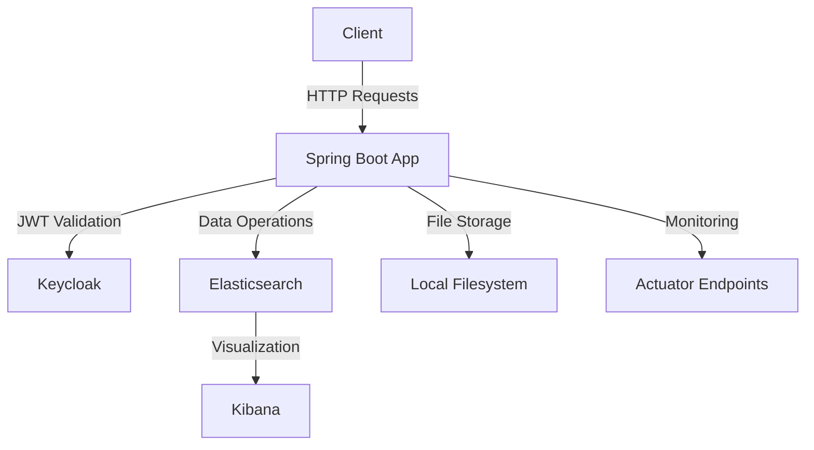

# Critique - Restaurant Review Platform

## 🌟 Features

**Comprehensive Restaurant Review Platform** with modern authentication and search capabilities:

- **Restaurant Management**: Create, update, delete, and search restaurants with detailed information
- **Review System**: Users can post, update, and delete reviews with ratings (1-5 stars)
- **Photo Uploads**: Upload and manage restaurant photos with captions
- **Advanced Search**: Full-text search with filters (name, cuisine, location, rating range)
- **Pagination**: Efficient data retrieval with customizable page sizes (1-50 items)
- **Sorting**: Flexible sorting by date, rating, or relevance
- **JWT Authentication**: Secure OAuth2 integration with Keycloak
- **Role-Based Access Control**: Fine-grained permissions for different user roles
- **Elasticsearch Integration**: High-performance search and analytics
- **File Storage**: Local file uploads with size limits (5MB max)
- **Health Monitoring**: Actuator endpoints for system health and metrics

---

## 🛠️ Tech Stack

### Backend

- **Java 25** - Latest LTS version with performance improvements
- **Spring Boot 4.0** - Enterprise-grade framework
- **Spring Security** - Comprehensive security framework
- **Spring Data Elasticsearch** - Search engine integration
- **Spring Web MVC** - RESTful API development
- **Spring Validation** - Request validation
- **Spring Actuator** - Production monitoring

### Security & Authentication

- **Keycloak 26.4** - Open-source identity and access management
- **OAuth2 Resource Server** - JWT token validation
- **Spring Security OAuth2** - Authentication integration

### Data & Storage

- **Elasticsearch 9.2** - Distributed search and analytics engine
- **H2 Database** (for Keycloak) - Embedded database for development

### Development & Build

- **Maven 3.0** - Dependency management and build tool
- **Lombok** - Code generation for boilerplate reduction
- **MapStruct 1.6** - Type-safe mapping between objects
- **Spotless** - Code formatting and style enforcement

### API Documentation

- **SpringDoc OpenAPI 3.0** - OpenAPI 3.0 documentation
- **Swagger UI** - Interactive API documentation

### Infrastructure

- **Docker Compose** - Container orchestration
- **Kibana 9.2** - Data visualization for Elasticsearch

---

## 📁 Project Structure

```bash
critique/
├── src/
│   ├── main/
│   │   ├── java/com/critique/
│   │   │   ├── configs/              # Configuration classes
│   │   │   ├── controllers/          # REST API endpoints
│   │   │   ├── dtos/                 # Data Transfer Objects
│   │   │   │   ├── requests/         # Request payloads
│   │   │   │   └── responses/        # Response payloads
│   │   │   ├── entities/             # JPA/Elasticsearch entities
│   │   │   ├── exceptions/           # Custom exception handling
│   │   │   ├── mappers/              # MapStruct mappers
│   │   │   ├── repositories/         # Data access layers
│   │   │   ├── services/             # Business logic
│   │   │   └── utils/                # Utility classes
│   │   └── resources/
│   │       └── application.yaml      # Configuration properties
│   └── test/                         # Unit and integration tests
├── uploads/                          # File upload storage
├── compose.yaml                      # Docker Compose configuration
├── pom.xml                           # Maven build configuration
└── README.md                         # Project documentation
```

---

## 📋 Prerequisites

### System Requirements

- **Java 25** or higher
- **Maven 3.8+**
- **Docker** and **Docker Compose** (for local development)
- **Minimum 4GB RAM** (for Elasticsearch container)
- **Ports**: 8080 (app), 9200 (Elasticsearch), 5601 (Kibana), 9090 (Keycloak)

---

## 🚀 Getting Started

### 1. Clone the Repository

```bash
git clone https://github.com/nathsagar96/critique.git
cd critique
```

### 2. Start Infrastructure Services

```bash
docker compose up -d
```

This will start:

- Elasticsearch (port 9200)
- Kibana (port 5601)
- Keycloak (port 9090)

### 3. Configure Keycloak

1. Access Keycloak admin console: [http://localhost:9090](http://localhost:9090)
2. Login with credentials: `admin/admin`
3. Create a new realm named `critique`
4. Create roles: `ROLE_USER`, `ROLE_ADMIN`
5. Create users and assign appropriate roles

### 4. Build and Run the Application

```bash
# Build the project
./mvnw clean package

# Run the application
./mvnw spring-boot:run
```

### 5. Access the Application

- **API**: [http://localhost:8080/api/v1](http://localhost:8080/api/v1)
- **Swagger UI**: [http://localhost:8080/swagger-ui.html](http://localhost:8080/swagger-ui.html)
- **Actuator**: [http://localhost:8080/actuator](http://localhost:8080/actuator)

---

## 📡 API Endpoints

### Base URL: `/api/v1`

| Method | Endpoint | Description | Authentication |
| -------- | ---------- | ------------- | ---------------- |
| GET | `/restaurants` | Search restaurants with filters | Optional |
| POST | `/restaurants` | Create new restaurant | Required |
| GET | `/restaurants/{id}` | Get restaurant details | Optional |
| PUT | `/restaurants/{id}` | Update restaurant | Required |
| DELETE | `/restaurants/{id}` | Delete restaurant | Required |
| GET | `/restaurants/{id}/reviews` | Get restaurant reviews | Optional |
| POST | `/restaurants/{id}/reviews` | Create review | Required |
| PUT | `/restaurants/{id}/reviews/{reviewId}` | Update review | Required |
| DELETE | `/restaurants/{id}/reviews/{reviewId}` | Delete review | Required |
| POST | `/photos` | Upload photo | Required |
| GET | `/photos/{id}` | Get photo data | Optional |
| PATCH | `/photos/{id}` | Update photo caption | Required |
| DELETE | `/photos/{id}` | Delete photo | Required |

### Request/Response Examples

#### Create Restaurant

```bash
POST /api/v1/restaurants
Content-Type: application/json
Authorization: Bearer {jwt_token}

{
  "name": "Gourmet Bistro",
  "description": "French cuisine with modern twist",
  "cuisineType": "FRENCH",
  "address": {
    "street": "123 Main St",
    "city": "Paris",
    "state": "Île-de-France",
    "postalCode": "75001",
    "country": "France"
  },
  "operatingHours": {
    "monday": {
        "openTime": "18:00:00",
        "closeTime": "23:00:00"
    }
  }
}
```

#### Search Restaurants

```bash
GET /api/v1/restaurants?name=Bistro&cuisineType=FRENCH&minRating=4&page=1&size=10
```

---

## 🔐 Authentication

### Keycloak Integration

- **Issuer URI**: `http://localhost:9090/realms/critique`
- **JWK Set URI**: `http://localhost:9090/realms/critique/protocol/openid-connect/certs`
- **Token Format**: JWT with OAuth2 Bearer tokens
- **Roles Claim**: `roles` claim in JWT, prefixed with `ROLE_`

### Security Configuration

```yaml
spring:
  security:
    oauth2:
      resourceserver:
        jwt:
          issuer-uri: http://localhost:9090/realms/critique
          jwk-set-uri: http://localhost:9090/realms/critique/protocol/openid-connect/certs
```

### Token Management

1. Obtain token from Keycloak: `POST /realms/critique/protocol/openid-connect/token`
2. Include in requests: `Authorization: Bearer {token}`
3. Token validation: Automatic JWT validation with Spring Security

### Security Features

- **CORS**: Configured for frontend domains (`http://localhost:3000`, `http://localhost:8080`)
- **CSRF Protection**: Disabled for stateless API
- **Public Endpoints**: Swagger UI, health checks, and read-only operations

---

## 🔍 Search Capabilities

### Search Parameters

| Parameter | Type | Description | Example |
| ----------- | ------ | ------------- | --------- |
| `name` | String | Restaurant name (partial match) | `name=Bistro` |
| `cuisineType` | Enum | Cuisine type filter | `cuisineType=ITALIAN` |
| `location` | String | City or area | `location=Paris` |
| `minRating` | Number | Minimum rating (1-5) | `minRating=4` |
| `maxRating` | Number | Maximum rating (1-5) | `maxRating=5` |
| `page` | Integer | Page number (1-based) | `page=2` |
| `size` | Integer | Items per page (1-50) | `size=10` |
| `sort` | String | Sort criteria | `sort=rating,desc` |

### Performance Notes

- **Elasticsearch Indexing**: Real-time indexing for instant search results
- **Pagination**: Efficient cursor-based pagination
- **Caching**: Response caching for frequent queries
- **Query Optimization**: Analyzed fields for full-text search

---

## ⚙️ Configuration

### Environment Variables

| Variable | Description | Default |
| ---------- | ------------- | --------- |
| `ELASTICSEARCH_URIS` | Elasticsearch cluster URI | `http://localhost:9200` |
| `ELASTICSEARCH_USERNAME` | Elasticsearch username | - |
| `ELASTICSEARCH_PASSWORD` | Elasticsearch password | - |
| `KEYCLOAK_ISSUER_URI` | Keycloak issuer URI | `http://localhost:9090/realms/critique` |
| `KEYCLOAK_JWK_SET_URI` | Keycloak JWK set URI | `http://localhost:9090/realms/critique/protocol/openid-connect/certs` |

### Configuration Files

- **Development**: `application.yaml` (default)
- **Production**: `application-prod.yaml` (activated with `prod` profile)

### Profile Activation

```bash
# Development (default)
./mvnw spring-boot:run

# Production
./mvnw spring-boot:run -Dspring.profiles.active=prod
```

---

## 📖 Business Rules

### Restaurant Management

- **Ownership**: Only restaurant owners can update/delete their restaurants
- **Validation**: Required fields: name, address, operating hours
- **Rating Calculation**: Average of all reviews (1-5 stars)

### Review System

- **Single Review**: One review per user per restaurant
- **Rating Range**: 1-5 stars (integer values only)
- **Edit Window**: Reviews can be edited within 24 hours
- **Deletion**: Only review authors or admins can delete

### Photo Uploads

- **File Types**: JPEG, PNG, GIF
- **Max Size**: 5MB per file
- **Content Types**: Automatic detection from file headers
- **Storage**: Local filesystem with unique filenames

---

## 🧪 Testing

### Test Frameworks

- **JUnit 5** - Unit testing
- **Mockito** - Mocking framework
- **Spring Boot Test** - Integration testing
- **Testcontainers** - Containerized testing (Elasticsearch)

### Running Tests

```bash
# Unit tests
./mvnw test

# Integration tests
./mvnw verify

# Specific test class
./mvnw test -Dtest=RestaurantControllerTest
```

---

## 🤝 Contributing

### Guidelines

1. **Branch Naming**: `feature/`, `bugfix/`, `docs/` prefixes
2. **Commit Messages**: Follow [Conventional Commits](https://www.conventionalcommits.org/)
3. **Pull Requests**: Reference issue numbers, include screenshots for UI changes

### Development Workflow

```bash
# Create feature branch
git checkout -b feature/new-search-filter

# Commit changes
git commit -m "feat: add cuisine type filter to search"

# Push and create PR
git push origin feature/new-search-filter
```

### Code Style

- **Formatting**: Spotless with Palantir Java format
- **Imports**: Organized, no wildcards
- **Documentation**: Javadoc for public APIs

---

## 📄 License

**MIT License** © 2026 Critique

[Full License Text](LICENSE)

- **Permissions**: Commercial use, modification, distribution
- **Limitations**: Liability, warranty
- **Conditions**: License and copyright notice

---

## 🎯 Architecture Diagram



---
